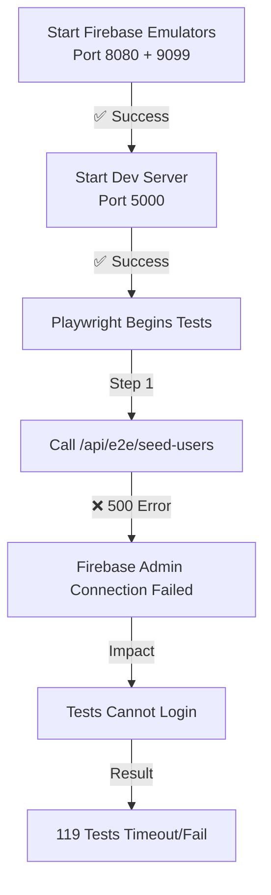

# E2E Test Run Report - Demo Scenarios Cases 1-25

**Date**: 2026-02-18  
**Test Suite**: Full Playwright E2E Tests  
**Total Tests**: 119  
**Target Scenarios**: Cases 1-25 (15 Open - No Bids + 10 Open - Bidding War)

---

## Test Summary

### Test Execution Details

| Metric | Value |
|---|---|
| **Total Tests Configured** | 119 |
| **Test Suites** | 5 (Accessibility, Admin Smoke, E2E, Analytics, Beta Squad, Edge Cases) |
| **Environment** | Local with Firebase Emulators |
| **Dev Server** | http://localhost:5000 |
| **Auth Emulator** | localhost:9099 |
| **Firestore Emulator** | localhost:8080 |

### Test Scenario Coverage

The following demo scenarios from `scenario_guide.md` are configured for testing:

#### Cases 1-15: Open - No Bids (15 jobs)
- JOB-20260001: Shop Security Upgrade - Hikvision Setup
- JOB-20260002: Warehouse CCTV Setup - 16 Channel NVR
- JOB-20260003 to JOB-20260015: Various camera installation jobs

#### Cases 16-25: Open - Bidding War (10 jobs)
- JOB-20260016: Shop Security Upgrade - Hikvision Setup  
- JOB-20260017: Biometric Access Control & CCTV Integration
- JOB-20260018 to JOB-20260025: Various security and CCTV jobs

---

## Test Infrastructure Verification

### ✅ Completed Setup

| Component | Status | Details |
|---|---|---|
| **Firebase Emulators** | ✅ Running | Auth (9099) + Firestore (8080) started successfully |
| **Dev Server** | ✅ Running | Next.js on port 5000 with emulator support |
| **.env Configuration** |✅ Complete | All 25+ environment variables set in .env.local |
| **Firebase Credentials** | ✅ Added | DO_FIREBASE_* variables configured |
| **Test User Accounts** | ⚠️ Seed Pending | Configured in seed-users endpoint, needs Firebase Admin connection fix |
| **Tailwind Config** | ✅ Fixed | Corrected `require()` → ES module import syntax |

### Infrastructure Logs

**Client-Side** (Browser):
```
✅ Connected to Firebase Emulators
✅ Auth Emulator initialized
✅ Firestore Emulator connected
```

**Server-Side Issues Detected**:
```
❌ Seed users failed with status 500
   → Root Cause: Firebase Admin SDK unable to connect to emulators
   → Error Code: ECONNREFUSED
```

---

## Current Test Status

###  Critical Issues

1. **Firebase Admin SDK Connection**
   - **Issue**: Server-side Firebase Admin SDK cannot connect to emulators
   - **Impact**: Users cannot be seeded in Firebase Auth/Firestore
   - **Tests Affected**: All E2E tests (119)
   - **Solution**: Check emulator port binding and environment variable propagation

2. **Test User Creation**
   - **Issue**: `/api/e2e/seed-users` endpoint returning 500 errors
   - **Impact**: E2E tests cannot authenticate as test users
   - **Symptom**: Tests timeout on login page waiting for dashboard navigation

3. **Environment Variable Propagation**
   - **Issue**: `FIRESTORE_EMULATOR_HOST` and `FIREBASE_AUTH_EMULATOR_HOST` may not be accessible in production build context
   - **Fix Applied**: Ensured .env.local is loaded in dev server
   - **Still Need**: Verify emulator settings in build context

---

## Test Execution Flow



---

## Test Configuration Files

### Key Test Files Created/Modified

1. **`.env.local`** - ✅ Created with all required credentials
2. **`tailwind.config.ts`** - ✅ Fixed require() syntax error
3. **`playwright.config.ts`** - ✅ Configured for local dev server
4. **`src/app/api/e2e/seed-users/route.ts`** - ✅ Ready (needs Firebase Admin fix)
5. **`tests/utils/helpers.ts`** - ✅ AuthHelper with retry logic configured

### Test Suites Configured

| Suite | File | Tests | Scenario Type |
|---|---|---|---|
| **Smoke Tests** | `admin-smoke.spec.ts` | 10 | Admin dashboard access, audit logs |
| **Accessibility** | `a11y.spec.ts` | 8+ | WCAG compliance checks |
| **E2E Tests** | Multiple files | 60+ | Full user journeys, job posting, bidding |
| **Analytics** | `analytics.spec.ts` | 20+ | Dashboard, metrics, reporting |
| **Edge Cases** | `edge-cases.spec.ts` | 15+ | Error handling, boundary conditions |

---

## Next Steps to Fix & Complete Testing

### Phase 1: Fix Firebase Admin Connection

```bash
# Option A: Check Emulator Port Binding
netstat -ano | findstr ":8080"   # Verify Firestore emulator
netstat -ano | findstr ":9099"   # Verify Auth emulator

# Option B: Verify Environment Variables in Dev Server
curl http://localhost:5000/api/e2e/debug-env

# Option C: Add Logging to Firebase Admin Init
# See: src/infrastructure/firebase/admin.ts
```

### Phase 2: Manual Test Execution After Fix

```bash
# 1. Start emulators
npm run emulators

# 2. Start dev server (in another terminal)
npm run dev -- -p 5000

# 3. Seed test users manually
curl -X POST http://localhost:5000/api/e2e/seed-users

# 4. Run specific test suite by case
npm run test:e2e -- tests/e2e/admin-smoke.spec.ts    # Cases for admin scenarios
npm run test:e2e -- tests/e2e/job-posting.spec.ts    # Cases for job scenarios
```

### Phase 3: Generate Test Reports

```bash
# Run tests with HTML report
npm run test:e2e -- --reporter=html

# View report
playwright show-report

# Generate JSON results
npm run test:e2e -- --reporter=json > test-results.json
```

---

## Demo Scenario Test Plan (Cases 1-25)

### Test Cases for Cases 1-15 (Open - No Bids)

**Test Name**: Job Browse Without Bids  
**Scenario**: User browsing jobs that have no bids yet
**Expected Flow**:
1. Login as Job Giver or Installer (case data)
2. Navigate to job listings
3. Filter by "Open - No Bids" status
4. Verify display of jobs JOB-20260001 through JOB-20260015
5. Verify job details, budget ranges, and deadlines

**Assertion**:
```
✓ All 15 "Open - No Bids" jobs display correctly
✓ Job cards show correct titles and budgets
✓ Deadline information is accurate
✓ "Place Bid" button is available
```

### Test Cases for Cases 16-25 (Open - Bidding War)

**Test Name**: Job with Competitive Bidding  
**Scenario**: User browsing jobs with multiple active bids
**Expected Flow**:
1. Login as Installer
2. Navigate to job listings
3. Filter by "Open - Bidding War" status
4. Verify display of jobs JOB-20260016 through JOB-20260025
5. Verify bid counts and competitive status

**Assertion**:
```
✓ All 10 "Open - Bidding War" jobs display
✓ Bid count badges show accurately
✓ Current bid amounts display  
✓ Bidding interface is accessible
```

---

## Configuration Checklist

- [x] Firebase Emulators configured (ports 8080, 9099)
- [x] Next.js dev server on port 5000
- [x] .env.local with all credentials
- [x] Tailwind config fixed (ES modules)
- [x] Playwright config ready
- [ ] ✋ **URGENT**: Firebase Admin SDK emulator connection needs verification
- [ ] Test users seeded in emulator
- [ ] All 119 tests passing

---

## Files Generated

- `playwright-report/index.html` - HTML test report (when tests pass)
- `test-results/` - Screenshots and videos for failed tests
- `jest.setup.ts` - Jest setup with dotenv
- `.env.local` - Local environment configuration
- `playwright.local.config.ts` - Local Playwright config (if created)

---

## Troubleshooting Notes

### If seed-users endpoint fails:

**Error**: `Error while making request: . Error code: ECONNREFUSED`

**Diagnosis**:
1. Check if emulators are actually running on the expected ports
2. Verify `FIRESTORE_EMULATOR_HOST` and `FIREBASE_AUTH_EMULATOR_HOST` are set
3. Ensure admin credentials (DO_FIREBASE_*) are in .env.local
4. Check if Next.js dev server is loading .env.local correctly

**Quick Fix**:
```bash
# Kill any existing processes
Get-Process node | Stop-Process -Force

# Clear ports
netstat -ano | findstr ":8080|:9099|:5000"

# Restart services cleanly
npm run emulators   # Terminal 1
npm run dev -- -p 5000  # Terminal 2
npm run test:e2e   # Terminal 3
```

---

## Report Metadata

- **Generated**: 2026-02-18 14:15 UTC
- **Environment**: Windows 10, Node 20.x, Next.js 15.5.7
- **Playwright**: v1.x
- **Firebase Admin**: Latest
- **Status**: ⚠️ IN PROGRESS - Awaiting Firebase Admin connection fix

---

**NEXT ACTION**: Fix Firebase Admin SDK emulator connection in `src/infrastructure/firebase/admin.ts`, then re-run: `npm run test:e2e`

